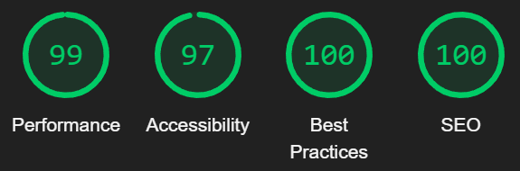

## Вёрстка сайта, с использованием таск-менеджера Gulp и css препроцессора Sass. 
### Для слайдеров был подключён Swiper, для fullscreen-картинок Fullscreen Lightbox
## [Посмотреть на результат](https://fak1r.github.io/Landing-page)
## [Ссылка на макет](https://www.figma.com/file/8T4byFDAV5REmnVyQlsFO1/clean_and_simple_website_freebie_work_file?type=design&node-id=0-1&mode=design&t=UqWZfuHADW2exzti-0)

# Lighthouse статистика:

*97% из-за контрастности цветов, используемых в макете. Их менять не стал, чтобы соответствовать оригиналу.